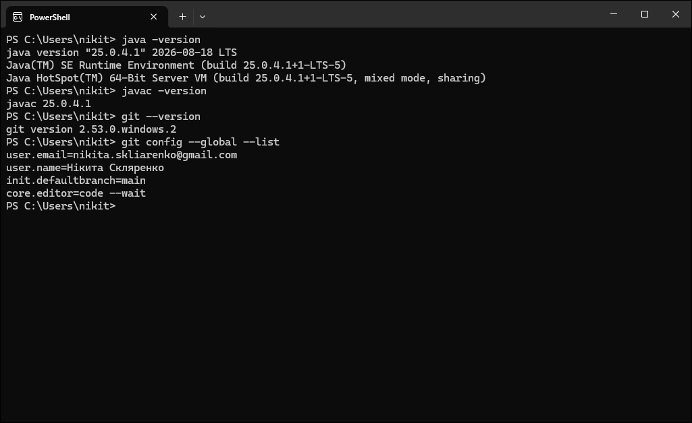
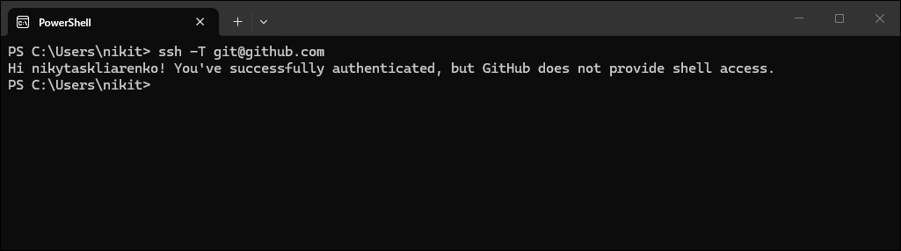
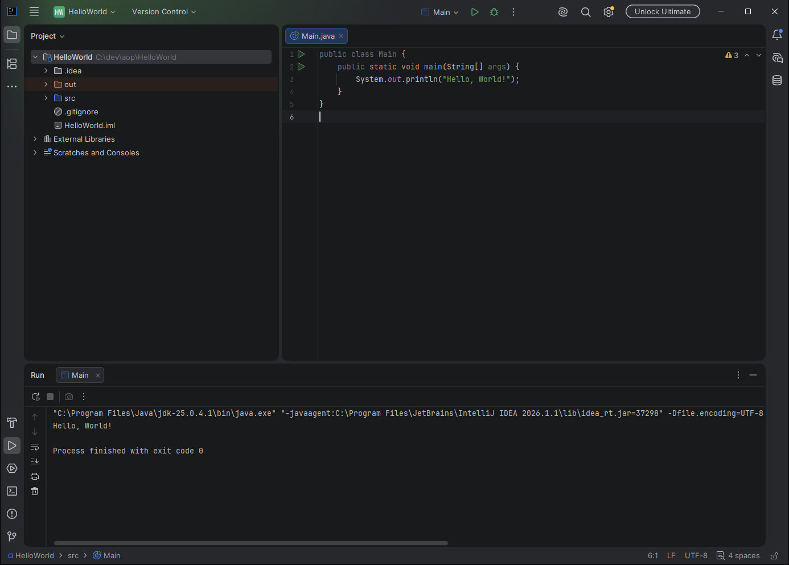
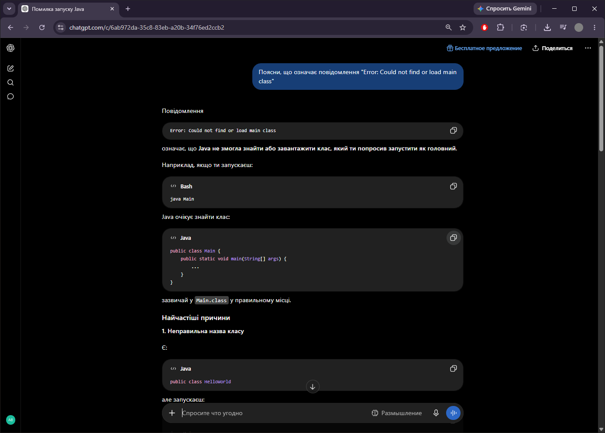
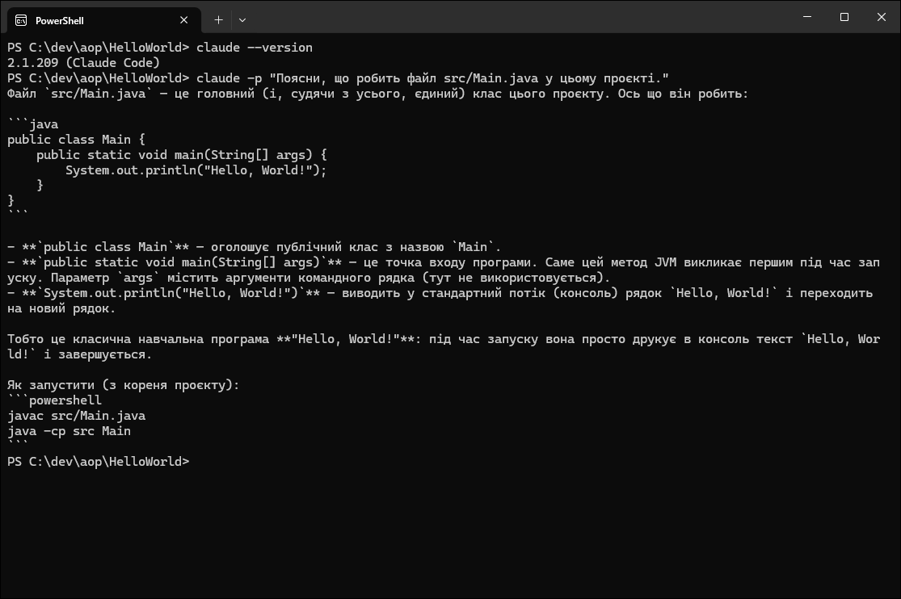

# Практичне заняття № 0. Підготовка робочого середовища розробника

**Дисципліна:** Алгоритмізація та основи програмування  
**Тема:** Підготовка робочого середовища розробника мовою Java: облікові записи GitHub, LeetCode, HackerRank; встановлення та налаштування Git, SSH-ключа, Oracle JDK 25 і IntelliJ IDEA.   
**Студент:** Скляренко Нікита   
**Група:** Б2F201ДОН26

## Профілі

- GitHub: https://github.com/nikytaskliarenko
- LeetCode: https://leetcode.com/u/nikytaskliarenko/
- HackerRank: https://www.hackerrank.com/profile/nikita_skliaren1

## Виведення команд

## SSH-з'єднання з GitHub

## IntelliJ IDEA: перша програма

## HackerRank: Welcome to Java!

## Інструменти ШІ

## Проблеми під час встановлення та їх усунення

1. **Команда `java` вказувала на зламану Java 8.** Першим у системному `Path` стояв каталог `C:\Program Files (x86)\Common Files\Oracle\Java\java8path`, а каталог самої JRE 8 було видалено, тому `java` аварійно завершувалася. Команда `javac` при цьому бралася з JDK 21 з іншого каталогу. Розв'язання: встановлено Oracle JDK 25, створено системну змінну `JAVA_HOME`, запис `%JAVA_HOME%\bin` поставлено на початок системного `Path`.
2. **Кирилиця в шляху.** Каталог документів (`...\OneDrive\Документи\...`) містить кирилицю й синхронізується OneDrive, тому Java-проєкти розміщено в `C:\dev\aop`.